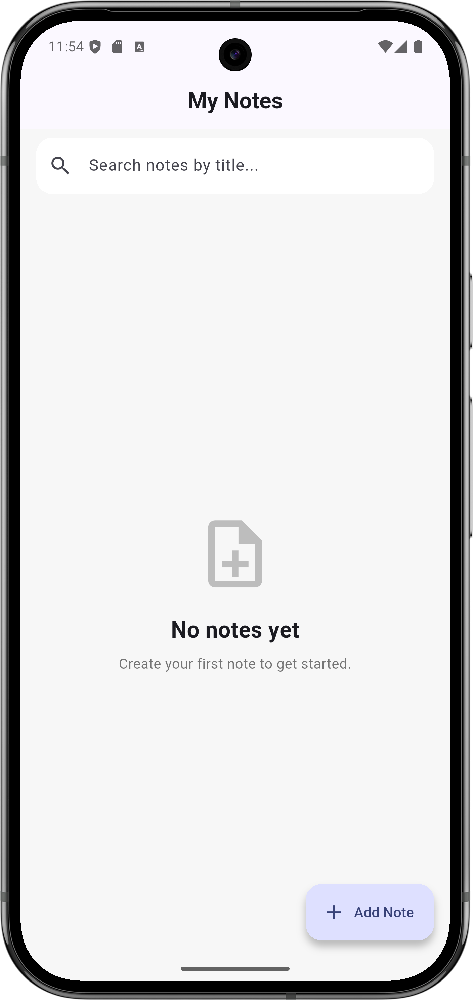
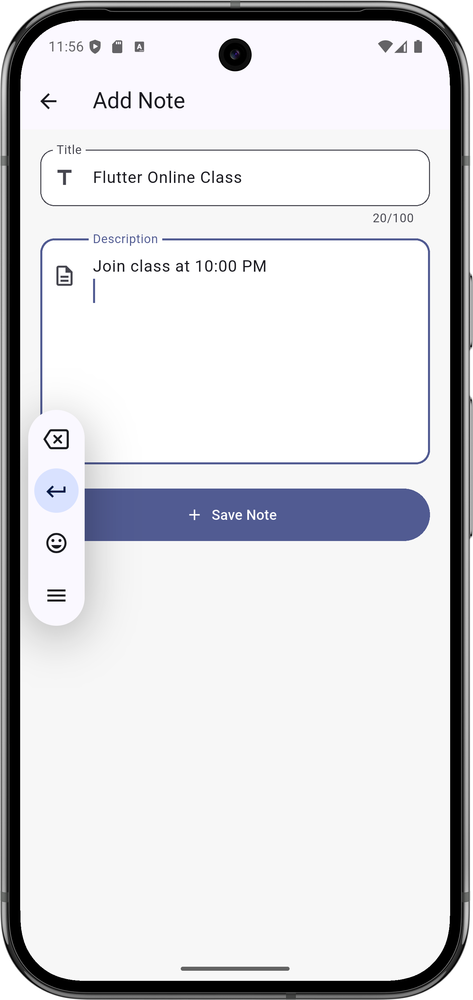
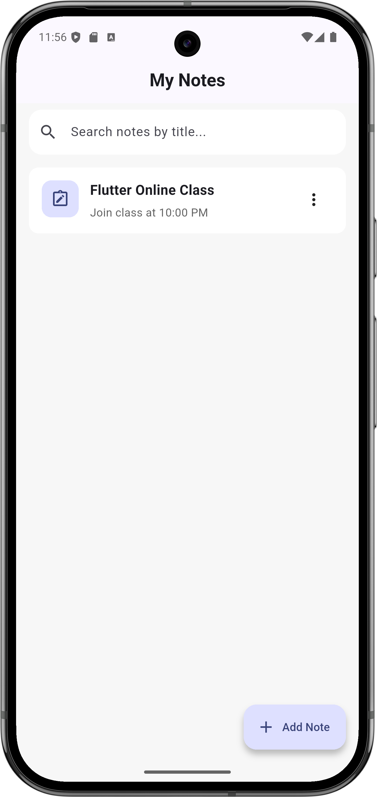
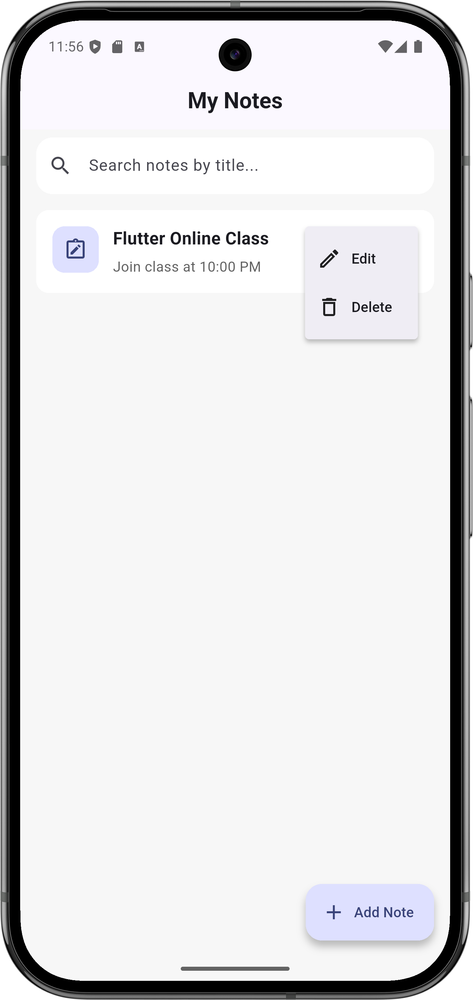
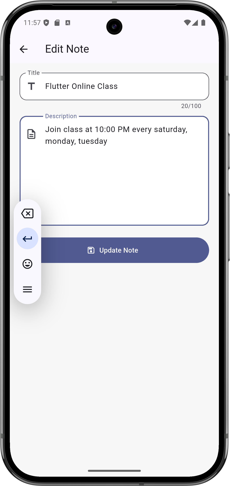
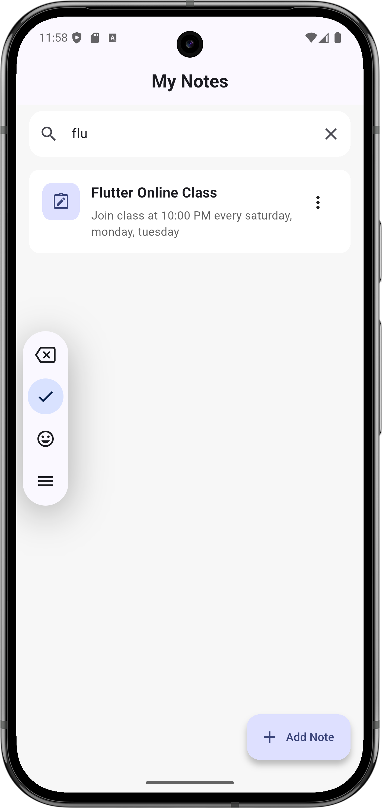
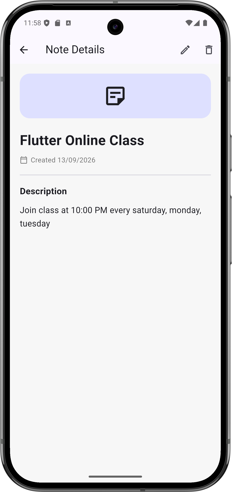
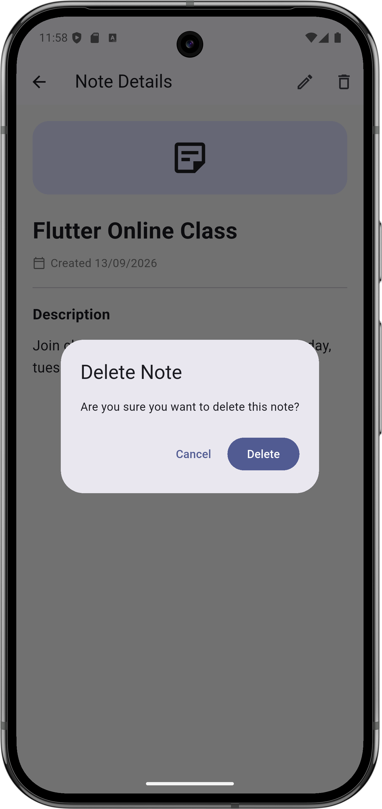

# Notes App 📝

A feature-rich, beautiful, and lightweight Flutter note-taking application designed to help you quickly capture, organize, search, and manage your daily notes and ideas with local persistence using **Hive**.

---

## ✨ Features

- **Create Notes**: Add new notes with titles and rich descriptions.
- **View Notes**: Browse your notes in a clean card-based layout with creation dates.
- **Note Details**: View full note content with dedicated detail views.
- **Edit Notes**: Update existing note titles and content seamlessly.
- **Delete Notes**: Remove unwanted notes with confirmation dialogs.
- **Real-time Search**: Instantly filter notes by title as you type.
- **Local Persistence**: Powered by **Hive**, ensuring lightning-fast offline local storage.
- **Modern UI/UX**: Built with Material Design principles, custom color schemes, smooth navigation, empty states, and feedback SnackBars.

---

## 🛠️ Tech Stack & Dependencies

- **Flutter** (Dart framework)
- **Hive / Hive Flutter** (Fast lightweight key-value database for local storage)
- **Material Design 3** (Modern UI components & styling)

---

## 📱 App Screenshots

Here is a visual walkthrough of the Notes App across various features and screens:

### 1. Home Screen & Note List


### 2. Add New Note Screen


### 3. Populated Notes List


### 4. Note Details View


### 5. Edit Note Screen


### 6. Delete Confirmation Dialog


### 7. Search Feature in Action


### 8. Empty Search / Zero State


---

## 🚀 Getting Started

### Prerequisites
- Flutter SDK installed ([Install Flutter](https://docs.flutter.dev/get-started/install))
- Dart SDK
- Android Studio / VS Code with Flutter extensions

### Installation & Running

1. **Clone the repository:**
   ```bash
   git clone https://github.com/your-username/notes_app.git
   cd notes_app
   ```

2. **Install dependencies:**
   ```bash
   flutter pub get
   ```

3. **Run the app:**
   ```bash
   flutter run
   ```

---

## 📁 Project Structure

```text
lib/
├── main.dart                 # App entry point & Hive initialization
├── models/
│   └── note.dart             # Note data model & Hive TypeAdapter
└── screens/
    ├── home_screen.dart      # Main notes list, search bar, & CRUD actions
    ├── add_edit_note_screen.dart # Form screen for creating & editing notes
    └── note_details_screen.dart # Detailed view of individual notes
```

---

## 📄 License

This project is open-source and available under the [MIT License](LICENSE).
