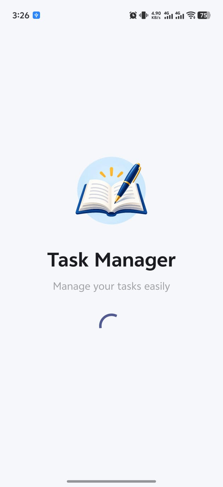
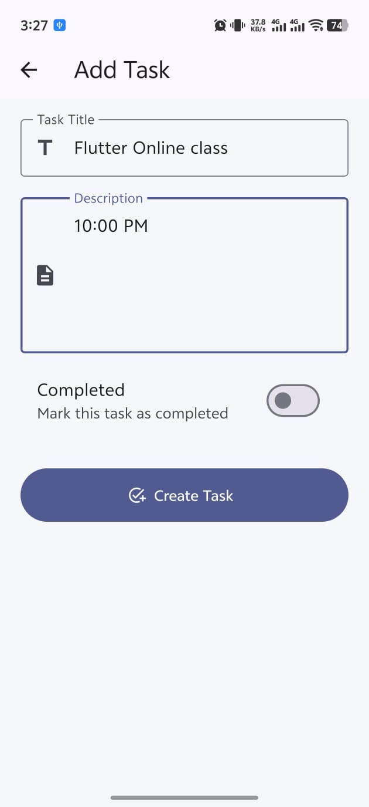
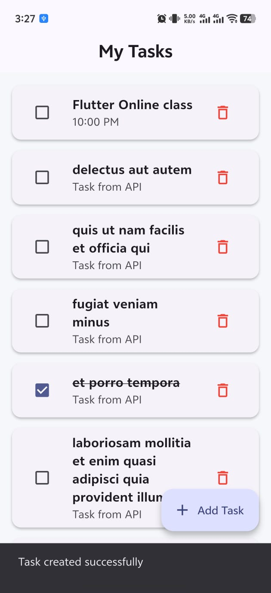
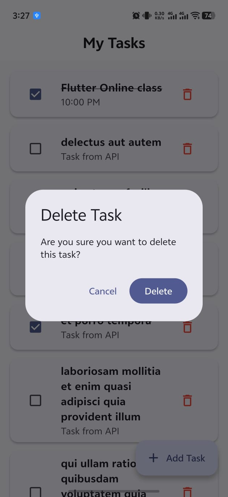
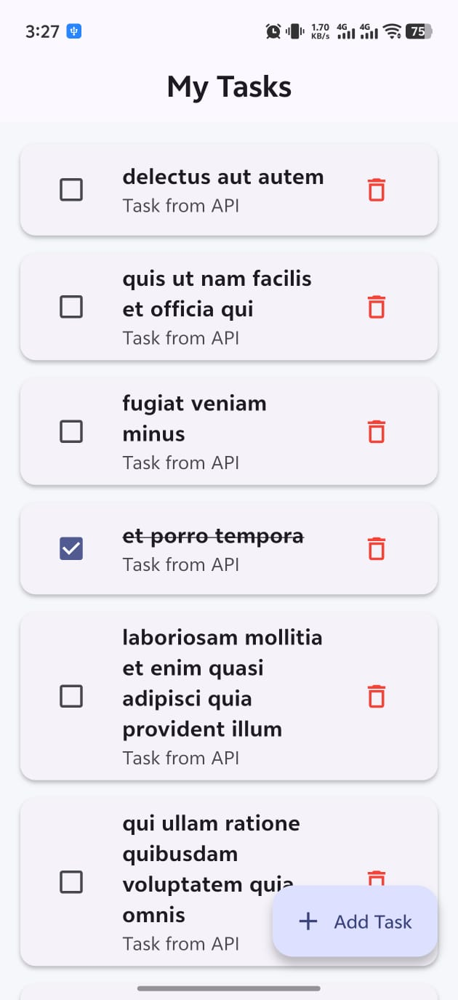

# 📝 Task Manager App


| Splash Screen | Add Task Form | Task Created |
| :---: | :---: | :---: |
|  |  |  |
| **Custom Splash Logo** | **Task Creation & Form Validation** | **Success Feedback & List Update** |

| Delete Task Dialog | Updated Task List |  |
| :---: | :---: | :---: |
|  |  |  |
| **Confirmation Alert Dialog** | **List View After Deletion** |  |

---

## ✨ Features & Functional Highlights

1. **Branded Splash Screen**:
   - Displays a custom Book & Pen logo (`assets/book_pen.png`) with animated loading indicator.
   - Smooth automated transition to the main task dashboard.

2. **Complete CRUD REST API Operations**:
   - **Create**: Add new tasks with title, description, and completion status via `POST /todos`.
   - **Read**: Fetch and display tasks dynamically from API via `GET /todos`.
   - **Update**: Edit existing tasks or toggle completed/pending status via `PUT /todos/{id}`.
   - **Delete**: Remove tasks safely with modal confirmation dialog via `DELETE /todos/{id}`.

3. **Robust State & Error Handling**:
   - **Loading State**: Circular progress indicators during data fetching.
   - **Error State**: User-friendly error UI with a **Try Again** retry button.
   - **Empty State**: Dedicated placeholder when no tasks are available.
   - **Pull to Refresh**: Swipe down to refresh the list of tasks from the backend.
   - **Form Validation**: Validates title (min 3 characters) and description before submission.
   - **SnackBar Notifications**: Instant feedback for successful or failed actions.

---

## 🛠 Project Architecture & File Structure

```
task_manager_app/
├── assets/
│   └── book_pen.png              # Splash screen book & pen logo
├── images/                       # App preview screenshots
│   ├── 1.jpeg                    # Task list & created notification
│   ├── 2.jpeg                    # Delete task confirmation dialog
│   ├── 3.jpeg                    # Updated task list
│   ├── 4.jpeg                    # Add/Edit task screen
│   ├── 5.jpeg                    # Splash screen
│   └── 6.jpeg                    # Task list with completed items
├── lib/
│   ├── main.dart                 # Application entry point & theme configuration
│   ├── models/
│   │   └── task.dart             # Task data model (fromJson, toJson, copyWith)
│   ├── screens/
│   │   ├── splash_screen.dart    # Initial splash screen
│   │   ├── task_list_screen.dart # Main task list screen with CRUD actions
│   │   ├── task_detail_screen.dart # Task detail view
│   │   └── add_edit_task_screen.dart # Form screen for adding/editing tasks
│   ├── services/
│   │   └── api_service.dart      # REST API client handling GET, POST, PUT, DELETE
│   └── widgets/
│       └── task_card.dart        # Reusable custom card widget for task items
├── test/
│   └── widget_test.dart          # Widget tests
└── pubspec.yaml                  # Dependencies and assets configuration
```

---

## 🌐 API Endpoint Details

The application integrates with the REST API base URL: `https://jsonplaceholder.typicode.com`

| Operation | HTTP Method | Endpoint | Description |
| :--- | :--- | :--- | :--- |
| **Fetch Tasks** | `GET` | `/todos` | Fetches the list of initial tasks |
| **Create Task** | `POST` | `/todos` | Creates a new task |
| **Update Task** | `PUT` | `/todos/{id}` | Updates task details or status |
| **Delete Task** | `DELETE` | `/todos/{id}` | Deletes a task by ID |

---

## 🚀 Getting Started

### Prerequisites
- [Flutter SDK](https://docs.flutter.dev/get-started/install) (v3.13.2 or higher)
- Android Studio / VS Code with Flutter extensions
- Android Emulator or physical device

### Installation & Execution

1. **Clone the repository**:
   ```bash
   git clone <repository_url>
   cd task_manager_app
   ```

2. **Install dependencies**:
   ```bash
   flutter pub get
   ```

3. **Run the application**:
   ```bash
   flutter run
   ```

4. **Run unit & widget tests**:
   ```bash
   flutter test
   ```
