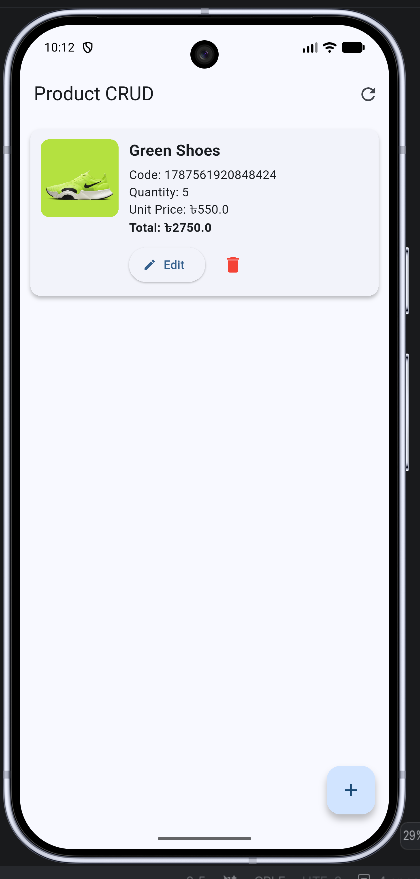
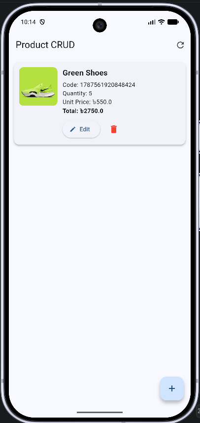
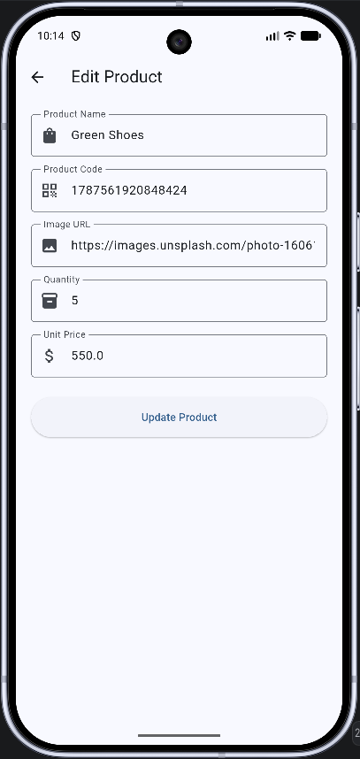
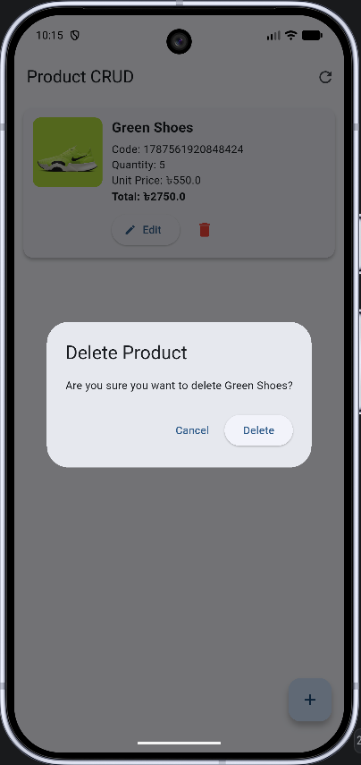
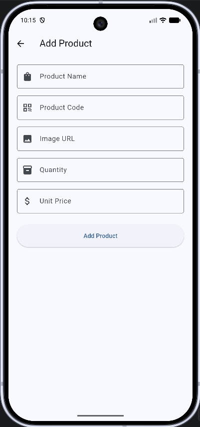

# REST API CRUD Operation

A Flutter application implementing complete CRUD (Create, Read, Update, Delete) operations using a REST API. This project was developed as part of the Ostad Flutter Batch 18 Module 10 Assignment.

## Features

- **Product Management**: View, add, edit, and delete products.
- **REST API Integration**: Uses the `http` package for network communication.
- **Form Validation**: Ensures data integrity when adding or editing products.
- **Pull-to-Refresh**: Refresh the product list with a simple gesture.
- **Responsive UI**: Clean and intuitive interface with loading indicators and snackbars for feedback.

## API Details

- **Base URL**: `https://crud-api-ostad-live.onrender.com/api/v1`
- **Endpoints**:
  - `GET /ReadProduct`: Fetch all products.
  - `POST /CreateProduct`: Create a new product.
  - `POST /UpdateProduct/:id`: Update an existing product.
  - `GET /DeleteProduct/:id`: Delete a product.

## App Screenshots

### 1. Product List

### 2. Add New Product

### 3. Form Validation

### 4. Edit Product

### 5. Success Feedback

## Getting Started

To run this project locally:

1. Clone the repository.
2. Navigate to the project directory.
3. Run `flutter pub get` to install dependencies.
4. Run `flutter run` to launch the app on your device or emulator.

---

For help getting started with Flutter development, view the [online documentation](https://docs.flutter.dev/), which offers tutorials, samples, guidance on mobile development, and a full API reference.
