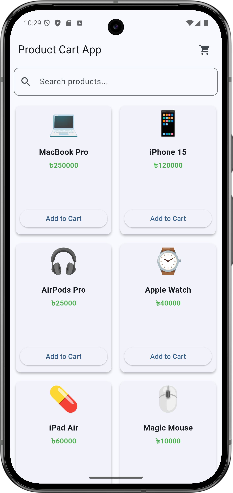
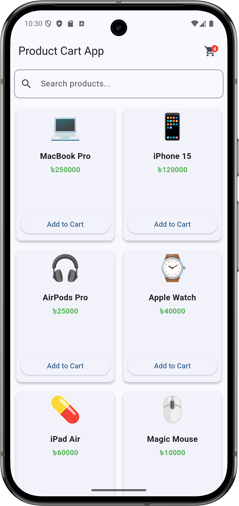
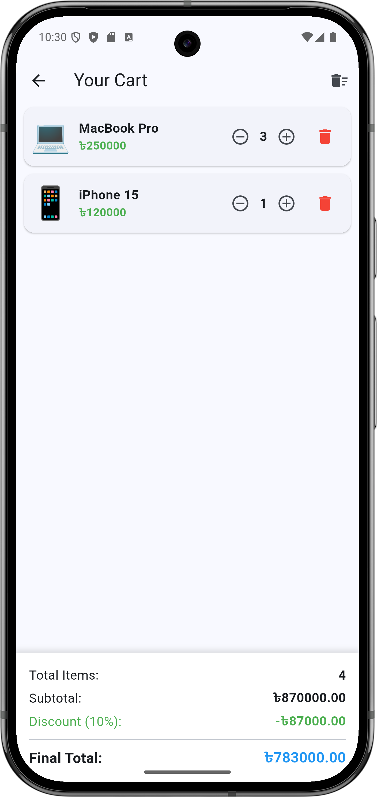
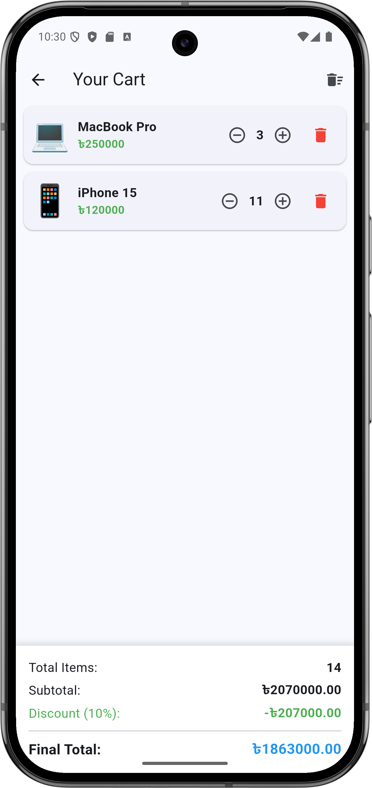
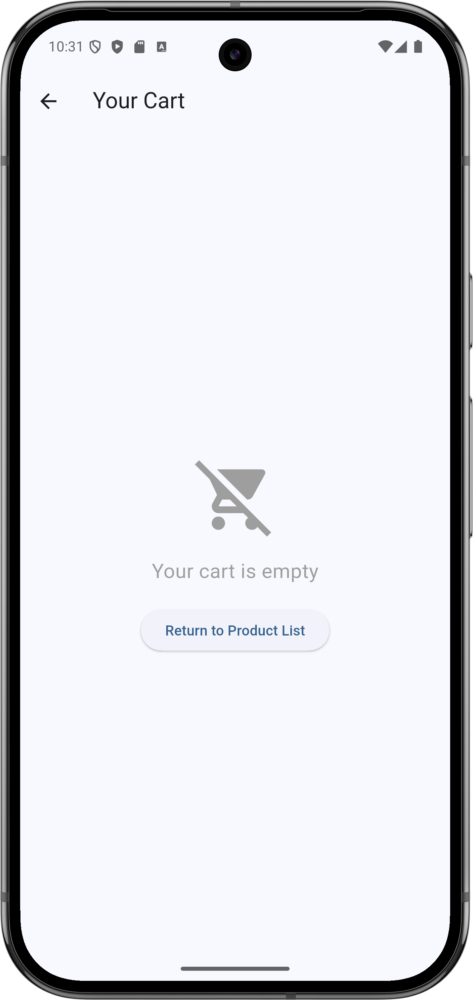

# Product Cart App

A Flutter application that demonstrates state management using the `provider` package.

## Features

* **Product List Screen:** Displays a local list of products with Add to Cart functionality.
* **Provider State Management:** Uses `ChangeNotifier` and `Provider` to handle the cart state (no `setState()` used for cart operations).
* **Cart Screen:** 
  * Displays added products.
  * Adjust quantities or remove items.
  * Real-time calculation of Subtotal, Total Items, and Final Total.
  * 10% Discount automatically applied if the subtotal exceeds ৳2000.
* **Bonus - Search functionality:** Includes a real-time search field to filter the local product list using Provider state.

## App Screenshots

<table>
  <tr>
    <td align="center"></td>
    <td align="center"></td>
    <td align="center"></td>
  </tr>
  <tr>
    <td align="center"></td>
    <td align="center"></td>
    <td></td> <!-- Empty column for spacing -->
  </tr>
</table>

## Getting Started

To run this project:

1. Clone the repository.
2. Ensure you have Flutter installed.
3. Run `flutter pub get` to install dependencies (e.g., `provider`).
4. Run `flutter run` on your preferred emulator or physical device.

A few resources to get you started if this is your first Flutter project:

- [Learn Flutter](https://docs.flutter.dev/get-started/learn-flutter)
- [Write your first Flutter app](https://docs.flutter.dev/get-started/codelab)
- [Flutter learning resources](https://docs.flutter.dev/reference/learning-resources)

For help getting started with Flutter development, view the
[online documentation](https://docs.flutter.dev/), which offers tutorials,
samples, guidance on mobile development, and a full API reference.
